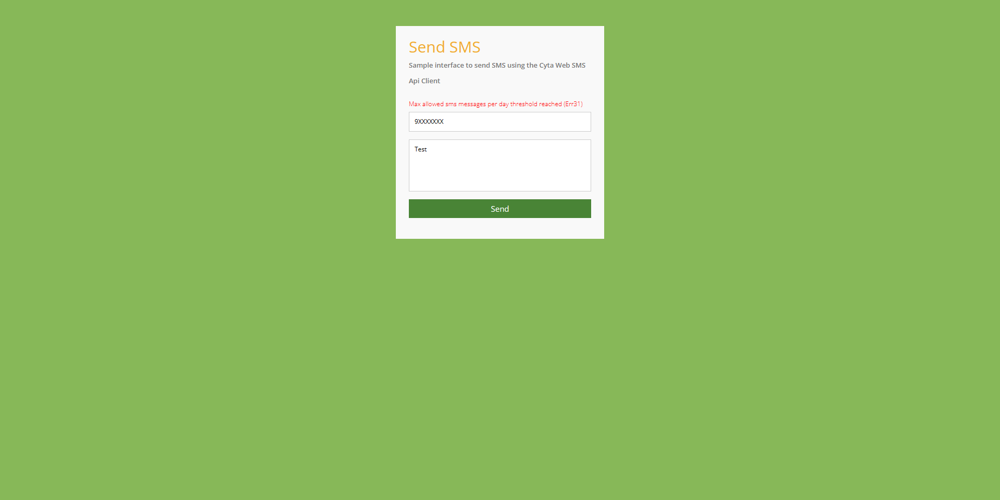

<div id="top"></div>

[![Contributors][contributors-shield]][contributors-url]
[![Forks][forks-shield]][forks-url]
[![Stargazers][stars-shield]][stars-url]
[![Issues][issues-shield]][issues-url]
[![MIT License][license-shield]][license-url]


<br />
<div align="center">
  <a href="https://github.com/dimitrist19/cytawebsmsapi-client">
    
  </a>

<h3 align="center">Cyta Web SMS Api Client</h3>

  <p align="center">
    An API client for Cyta Web SMS in PHP
    <br />
    <a href="https://github.com/dimitrist19/cytawebsmsapi-client/wiki"><strong>Explore the docs »</strong></a>
    <br />
    <br />
    <a href="https://dtprojects.eu.org/cytawebsmsapi-client/">View Demo</a>
    ·
    <a href="https://github.com/dimitrist19/cytawebsmsapi-client/issues">Report Bug</a>
    ·
    <a href="https://github.com/dimitrist19/cytawebsmsapi-client/issues">Request Feature</a>
  </p>
</div>


<!-- TABLE OF CONTENTS -->
<details>
  <summary>Table of Contents</summary>
  <ol>
    <li>
      <a href="#about-the-project">About The Project</a>
      <ul>
        <li><a href="#built-with">Built With</a></li>
      </ul>
    </li>
    <li>
      <a href="#getting-started">Getting Started</a>
    </li>
    <li><a href="#usage">Usage</a></li>
    <li><a href="#roadmap">Roadmap</a></li>
    <li><a href="#contributing">Contributing</a></li>
    <li><a href="#license">License</a></li>
    <li><a href="#contact">Contact</a></li>
  </ol>
</details>


<!-- ABOUT THE PROJECT -->
## About The Project

A simple api client for PHP applications where you can easily call a function to send sms through the Cyta Web SMS Platform and receive it's status code

[Sample Interface](/interface)




<p align="right">(<a href="#top">back to top</a>)</p>


### Built With

* [PHP](https://php.net) 


<p align="right">(<a href="#top">back to top</a>)</p>


<!-- GETTING STARTED -->
## Getting Started

### Obtaining Web Sms Api Keys

Login to MyCyta and visit [https://www.cyta.com.cy/web-sms-api/](https://www.cyta.com.cy/web-sms-api/). Enable the api and copy username and secret key. Then open `configuration.php` in client and enter details
```php
$websmsapi_config = array(
    "version" => "1.0",
    "username" => "ENTER_USERNAME_HERE", //Enter Cyta Web Sms Sender Username
    "apiKey" => "xxxxxxxxxxxxxxxxx", // Enter Cyta Web Sms Sender Api Key 
    "language" => "el"
);
```

<p align="right">(<a href="#top">back to top</a>)</p>


<!-- USAGE EXAMPLES -->
## Usage

Include the client
```php
require 'CLIENT_LOCATION/cytawebsmsapi-client/client/client.php';
```

Call the `cytawebsms_create_request` function and define *recipients*(array) & *message*(string)
```php
cytawebsms_create_request($recipients, $message);
```

The client will return an array in this format
*e.g. success example*
```php
array(
        "api_success" => true,
        "status_message" => "Send Sms success",
        "status_code" => "0",
        "lot" => "XXXXXXXXXX"
);
```
_For more examples, please refer to the [Documentation](https://github.com/dimitrist19/cytawebsmsapi-client/wiki)_

<p align="right">(<a href="#top">back to top</a>)</p>


<!-- ROADMAP -->
## Roadmap
See the [open issues](https://github.com/dimitrist19/cytawebsmsapi-client/issues) for a full list of proposed features (and known issues).

<p align="right">(<a href="#top">back to top</a>)</p>


<!-- CONTRIBUTING -->
## Contributing

Contributions are what make the open source community such an amazing place to learn, inspire, and create. Any contributions you make are **greatly appreciated**.

If you have a suggestion that would make this better, please fork the repo and create a pull request. You can also simply open an issue with the tag "enhancement".
Don't forget to give the project a star! Thanks again!

1. Fork the Project
2. Create your Feature Branch (`git checkout -b feature/AmazingFeature`)
3. Commit your Changes (`git commit -m 'Add some AmazingFeature'`)
4. Push to the Branch (`git push origin feature/AmazingFeature`)
5. Open a Pull Request

<p align="right">(<a href="#top">back to top</a>)</p>


<!-- LICENSE -->
## License

Distributed under the MIT License. See `LICENSE.md` for more information.

<p align="right">(<a href="#top">back to top</a>)</p>


<!-- CONTACT -->
## Contact

Dimitris T - dimitris@dtprojects.eu.org

Project Link: [https://github.com/dimitrist19/cytawebsmsapi-client](https://github.com/dimitrist19/cytawebsmsapi-client)

<p align="right">(<a href="#top">back to top</a>)</p>


<!-- MARKDOWN LINKS & IMAGES -->
<!-- https://www.markdownguide.org/basic-syntax/#reference-style-links -->
[contributors-shield]: https://img.shields.io/github/contributors/dimitrist19/cytawebsmsapi-client.svg?style=for-the-badge
[contributors-url]: https://github.com/dimitrist19/cytawebsmsapi-client/graphs/contributors
[forks-shield]: https://img.shields.io/github/forks/dimitrist19/cytawebsmsapi-client.svg?style=for-the-badge
[forks-url]: https://github.com/dimitrist19/cytawebsmsapi-client/network/members
[stars-shield]: https://img.shields.io/github/stars/dimitrist19/cytawebsmsapi-client.svg?style=for-the-badge
[stars-url]: https://github.com/dimitrist19/cytawebsmsapi-client/stargazers
[issues-shield]: https://img.shields.io/github/issues/dimitrist19/cytawebsmsapi-client.svg?style=for-the-badge
[issues-url]: https://github.com/dimitrist19/cytawebsmsapi-client/issues
[license-shield]: https://img.shields.io/github/license/dimitrist19/cytawebsmsapi-client.svg?style=for-the-badge
[license-url]: https://github.com/dimitrist19/cytawebsmsapi-client/blob/master/LICENSE.md
